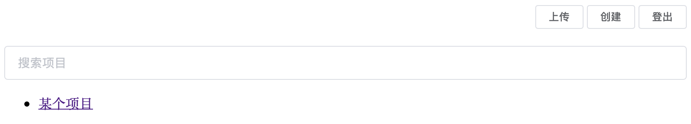

# AXOL

> axure online preview




## 开始使用

1. 登记账号
2. 登录账号
3. 创建项目
4. 上传项目
5. 预览

## 技术设计

使用json文件记录用户，项目信息。

用户数据结构如下：
```json
{
    "name": "hiwjd", // 用户名
    "pass": "123456", // 密码
    "projects": ["8941966ae7817d063d1f2be0c1d558b2", "ac801e2ec471a65497e45f2944642d4e"] // 下属项目ID组
}
```

项目数据结构如下：
```json
{
    "ID": "8941966ae7817d063d1f2be0c1d558b2", // 项目ID
    "name": "xxx项目", // 项目名称
    "versions": ["v1", "v2"] // 项目的所有版本
}
```

json文件存储目录如下：
```
├── data
│   ├── proj
│   │   ├── 8941966ae7817d063d1f2be0c1d558b2.json
│   │   └── ac801e2ec471a65497e45f2944642d4e.json
│   └── user
│       └── hiwjd.json
```

项目文件目录如下：
```
└── proj
    ├── 8941966ae7817d063d1f2be0c1d558b2
    │   ├── v1
    │   │   └── index.html
    │   └── v2
    │       └── index.html
    └── ac801e2ec471a65497e45f2944642d4e
        └── v1
            └── index.html
```

用户需要登录后，选择一个项目进行上传。每次上传都自动新增一位版本号。

访问`/p/latest/8941966ae7817d063d1f2be0c1d558b2/`即访问目录`proj/8941966ae7817d063d1f2be0c1d558b2/v2/`下的文件。

访问`/p/v1/8941966ae7817d063d1f2be0c1d558b2/`即访问目录`proj/8941966ae7817d063d1f2be0c1d558b2/v1/`下的文件。